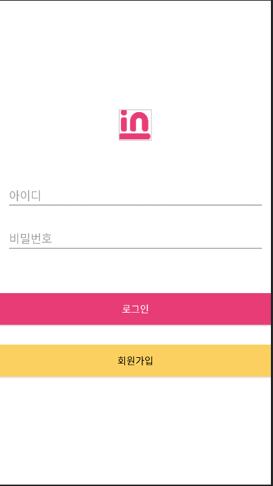
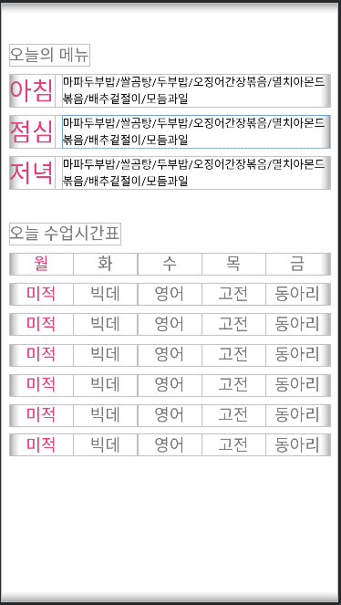
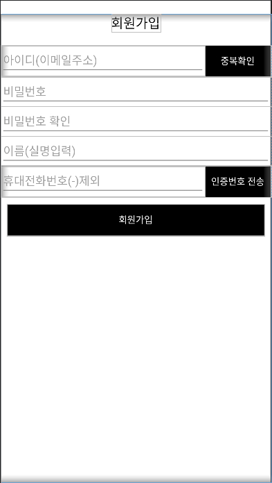
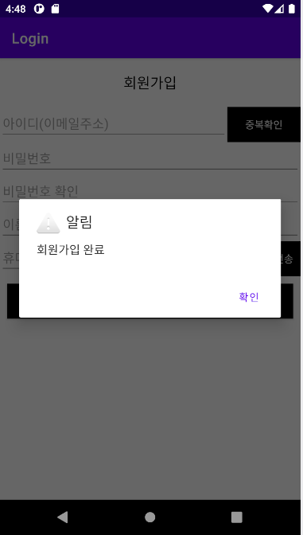

## 아래 요구사항에 맞게 구현하세요. 
## 깃허브 연동
github 
 
Create a new repository
 
Repository name : Login
 
Description (optional) : 안드로이드 로그인 기능 테스트
 
Add a README file 추가
 

아이콘 다운로드 

 

###  미니프로젝트 만들기
##

New Project
 
Empty Activity 
Name : Login 
Package name :  com.jycom.login 
Language : Java 
 
나머지 설정은 기존과 동일 
 

총 4개 Activity 
1. IntroActivity 시작화면 
### [인트로 화면]
  
* 이미지 사이즈
 - intro.PNG  
 -가로 : 200dp, 세로 : 150dp 
* 시작하기 버튼(AppCompatButton) 
 -가로 : 300dp, 세로 : 40dp 
 -배경색상 #878789 
 -텍스트색상 #ffffff 
   
2. LoginActivity 로그인 화면
### [로그인 화면]
  
* 이미지 사이즈 
 - icon.PNG 
 -가로 : wrap_content, 세로 : wrap_content 
* EditText
  - hint : 아이디  
  -가로 : match_parent, 세로 : wrap_content 
* EditText
  - hint : 비밀번호 
  -가로 : match_parent, 세로 : wrap_content 
* 로그인 버튼 (AppCompatButton)
  -가로 : match_parent, 세로 : wrap_content 
  -배경색상 : #E83C77 
  -텍스트색상 : #ffffff 
  -텍스트사이즈 : 15dp 

* 회원가입 버튼 (AppCompatButton)
  -가로 : match_parent, 세로 : wrap_content 
  -배경색상 : #FCD060 
  -텍스트색상 : #000000 
  -텍스트사이즈 : 15dp 
 
3. MainActivity 로그인 후 화면

### [메인 화면]
  

  - 오늘의 메뉴 & 오늘 수업시간표 
  - 화면보고 비슷하게 작성 
  - 칼라색은 #E83C77, #000000 
 
4. JoinActivity 회원가입 화면

 
### [회원가입 화면]
  
  - EditText 높이는 45dp 고정 
  * AppCompatButton 버튼  
    - 공통 배경색 #000000 
    - 텍스트 색상 #FFFFFF 

 
### * 요구사항
- 앱시작시 액티비티 : IntroActivity 
- IntroActivity 시작하기 버튼 클릭시 LoginActivity 실행 
- LoginActivity 로그인 버튼 클릭시 
  아이디 입력 안했을 경우 아이디를 입력해주세요 토스트 문구 
  비밀번호 입력 안했을 경우 비밀번호를 입력해주세요 토스트 문구 
  
  아이디 jycom,  비밀번호 1234 일 경우 MainActivity 실행 
  아이디와 비밀번호가 틀리면 아이디와 비밀번호를 확인해주세요 토스트 문구 
- LoginActivity 회원가입 클릭시 JoinActivity 실행 
- JoinActivity 회원가입 클릭시 다이얼로그 실행 
 
### [팝업 클릭 후]

   
  
  
