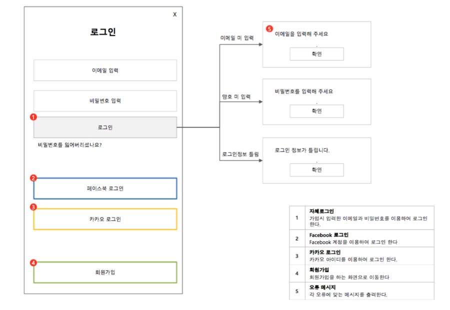

# 1주차

### 모바일 생태계
 - 안드로이드 개발자란?

 - 기업이 원하는 안드로이드 개발자
 - 네이버 신입개발자 채용

 - 라인 신입개발자 채용

### 안드로이드 특징
 - 리눅스 기반의 오픈소스가 특징
 - 파편화(구글에서 만든 안드로이드를 제조사가 커스텀해서 사용)
 - 안드로이드 VS 아이폰 비교
 - 안드로이드 VS 웹개발 비교
 - 중국시장은 구글 사용을 못해
 - 안드로이드 버전(https://472078.pe.kr/19)
 
 ### 안드로이드 컴포넌트 4가지
 - 안드로이드 앱의 아키텍처에서 가장 큰 특징은 컴포넌트 기반
 - 컴포넌트는 앱의 구성단위이며, 컴포넌트로 앱을 작성
 ##### 액티비티
 - UI를 구성하기 위한 컴포넌트 화면
 ##### 서비스
 - 화면과 상관없이 눈에 보이지않지만 백그라운드에서 수행하는 컴포넌트(ex 음악플레이어)
 ##### 콘텐츠 프로바이더
 - 앱 간의 데이터 공유 목적으로 사용하는 컴포넌트
 - 여러 앱들간의 데이터를 공유하기 위한 목적 예를 들면 주소록 데이터가 필요하면 주소록 앱의 데이터를 얻을수 있다.
 ##### 브로드캐스트 리시버
 - 이벤트 모델로 수행되는 컴포넌트, 배터리 부족, 시스템 부팅 등 특정 이벤트가 발생되면 작성하는 컴포넌트

### 안드로이드 스튜디오 개발환경 구축
 - 안드로이드 스튜디오 설치(IDE 통합개발환경)하기
 * 윈도우 사용자 계정에 한글이 포함되면 안됨.
 - 안드로이드 스튜디오 설정(SDK 다운로드 등)하기
 - AVD 설정
 - 스마트폰으로 실행
 - 삼성 통합 USB 드라이버 : https://www.samsungsvc.co.kr/download
 - LG 통합 USB 드라이버 : https://github.com/LucasDev86/jycom/blob/main/lecture/1week/lg_usb.exe
 - "Hello World" 첫 앱 실행하기

### 실무 개발자 업무 프로세스
 - 요구사항 > 기획자 > 디자이너 > 개발자(서버) > 개발자(안드로이드) > 개발완료 > 검수 > 수정 > 검수 > 배포(스토어)
 - 기획자의 기획서

 
 - 디자이너 가이드

