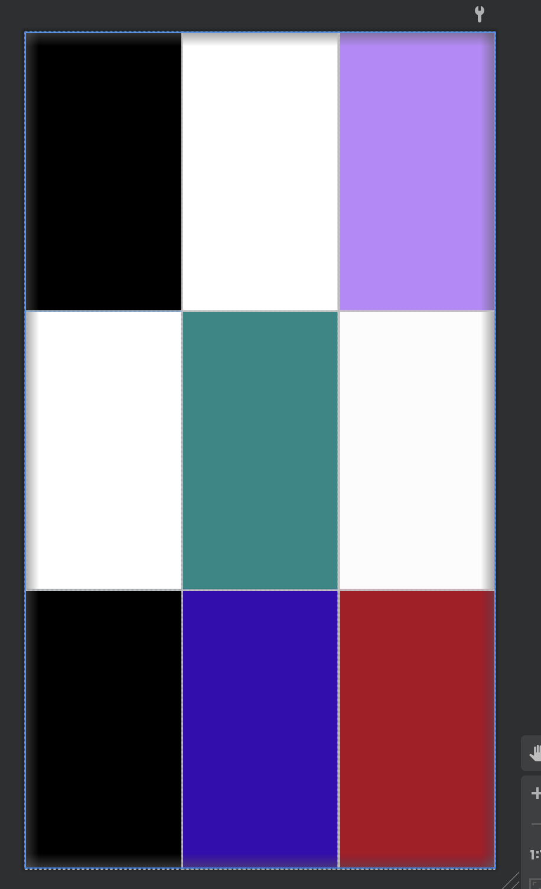
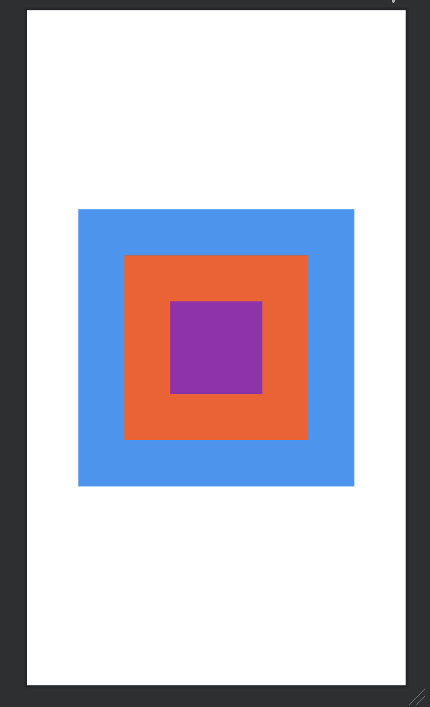

# 2주차

### 핸드폰마다 화면 크기가 다 다른데 어떻게 화면을 그려야 할까?
 - 픽셀, dpi, dp ,sp 단위
 - 픽셀 -> 핸드폰 화면에서 빛이 나오는 전구를 상징 -> 가장 작은 단위
 - dpi -> dot per inch
      - ldpi : 120 (1인치(=2.54cm)에 120픽셀)
      - mdpi : 160
      - hdpi : 240
      - xhdpi : 320
      - xxhdpi : 480
      - xxxhdpi : 640
 - 단말기 해상도에 따라 사용자가 보는 화면이 달라보임
 - px : 스크린의 실제 픽셀 단위
 - dp : Density Independent Pixcel / 픽셀 독립적인 단위
 - sp : 시스템 설정에 따라 영향을 받음 보통 글자

### UI 그리는 방법
  - xml을 이용해 ui 만들기
  - 자바소스에서 뷰를 그릴수 있다
  - 드래그를 통해서 ui 작성

#### 1. LinearLayout 
  - 실습

#### 2. Relativelayout
  - 실습

#### 3. FrameLayout
  - 실습

#### 4. ScrollView

#### 5. ImageView

