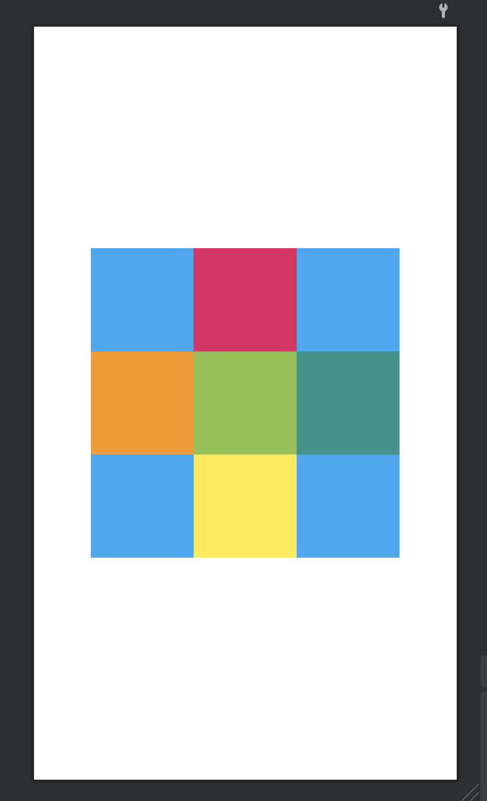

# 2주차

### 핸드폰마다 화면 크기가 다 다른데 어떻게 화면을 그려야 할까?
 - 픽셀, dpi, dp ,sp 단위
 - 픽셀 -> 핸드폰 화면에서 빛이 나오는 전구를 상징 -> 가장 작은 단위
 - dpi -> dot per inch
      - ldpi : 120 (1인치(=2.54cm)에 120픽셀)
      - mdpi : 160
      - hdpi : 240
      - xhdpi : 320
      - xxhdpi : 480
      - xxxhdpi : 640
 - 단말기 해상도에 따라 사용자가 보는 화면이 달라보임
 - px : 스크린의 실제 픽셀 단위
 - dp : Density Independent Pixcel / 픽셀 독립적인 단위
 - sp : 시스템 설정에 따라 영향을 받음 보통 글자

### UI 그리는 방법
  - xml을 이용해 ui 만들기
  - 자바소스에서 뷰를 그릴수 있다
  - 드래그를 통해서 ui 작성

#### 1. LinearLayout (https://lktprogrammer.tistory.com/132?category=741470)
  - 실습(1)
  - 요구사항
  - 화면에 동일한 사이즈 정사각형 TextView 각기 다른 색상 9개

  - 실습(2)
  - 요구사항
  - 화면에 비율에 맞게 다른 색상으로 구성

#### 2. Relativelayout (https://lktprogrammer.tistory.com/133?category=741470)
  - 실습
  - 요구사항
  - 100px 정사각형 TextView 각기 다른 색상 9개

#### 3. FrameLayout (https://lktprogrammer.tistory.com/134?category=741470)
  - 실습
  - 요구사항
  - 300dp 정사각형 , 200dp 정사각형, 100dp 정사각형 TextView 각기 다른 색상 중첩

#### 4. GridLayout (https://lktprogrammer.tistory.com/136?category=741470)
  - 격자형태로 배치하는 레이아웃.
  - 가로 열의 개수와 세로 행의 개수 추가
  - columCount="3" (가로=열)
  - rowCount="2" (세로=행)
  - 가로나 세로가 길어야 하는 경우 스팬을 사용
  - columnSpan="2" (가로)
  - rowSpan="2" (세로)
  - 가운데 공백이 들어가려면 <Space android:layout_gravity="fll_horizontal" androiod:layout_rowSpan="3"/> 

#### 5. ScrollView

#### 6. ImageView

#### 무료로 아이콘 다운로드 받을수 있는 사이트 
 - https://www.flaticon.com/kr/

#### Final 과제

- 요구사항
- ScrollView 사용하여 스크롤 되게 할 것.
- 강아지 이미지 다운로드 (https://github.com/LucasDev86/jycom/blob/main/lecture/2week/dog.png)
- 사람 이미지 다운로드 (https://github.com/LucasDev86/jycom/blob/main/lecture/2week/boy.png)
- 유튜브 이미지 다운로드 (https://github.com/LucasDev86/jycom/blob/main/lecture/2week/youtube.png)

