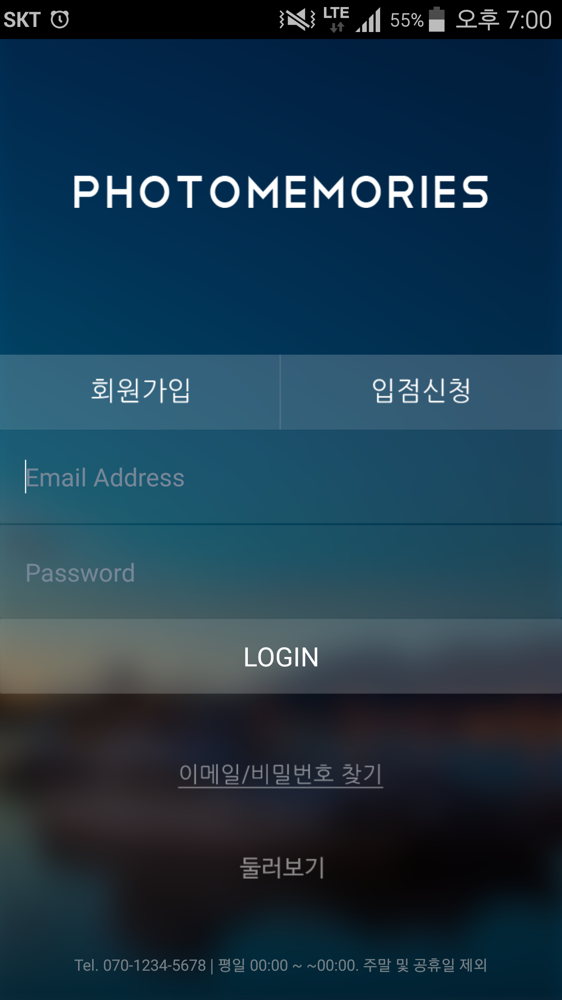
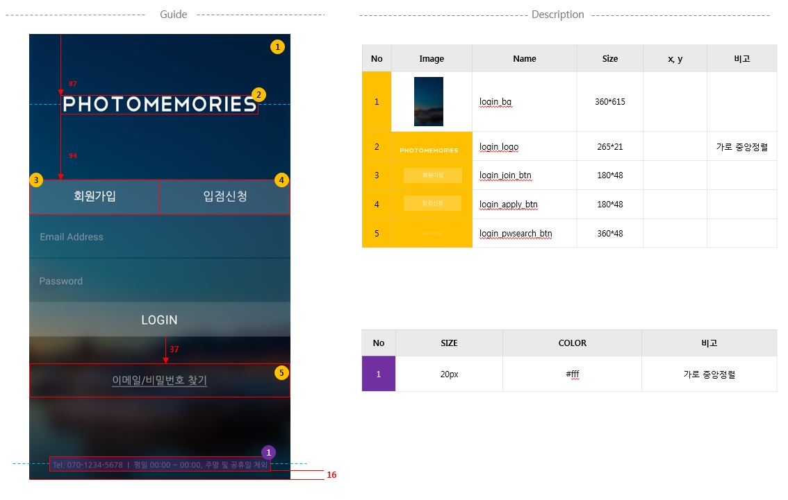
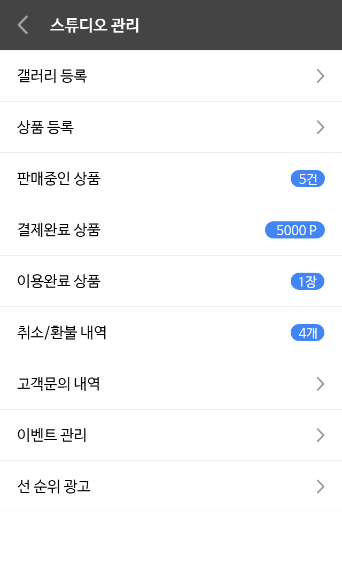
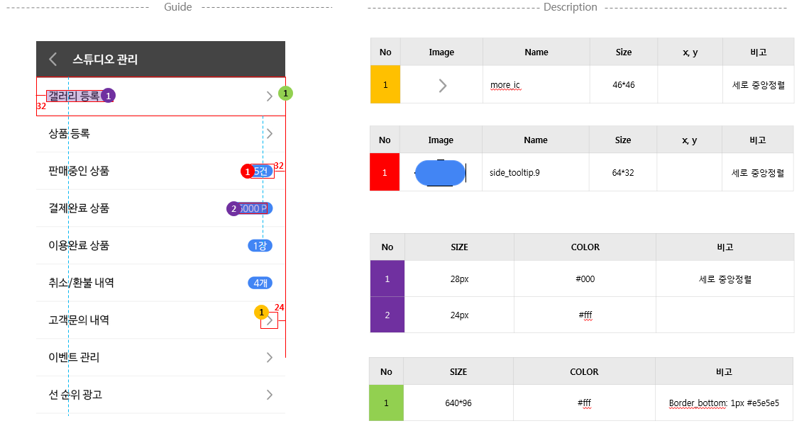

### 화면

### 가이드

### 화면

### 가이드

### 이미지 다운로드
(https://github.com/LucasDev86/jycom/blob/main/lecture/2week/real/images_poto.zip)
### 아이콘 다운로드
(https://github.com/LucasDev86/jycom/blob/main/lecture/2week/real/icon_poto.zip)
